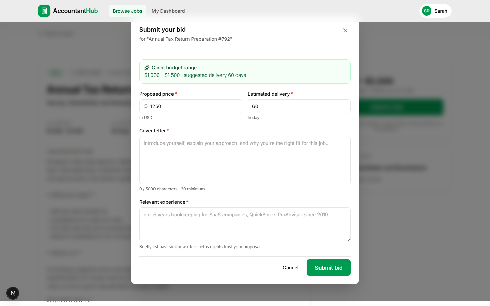
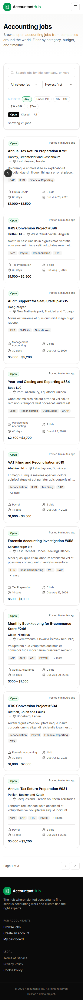

<div align="center">

# 💼 Accountant Hub

### *The marketplace where companies post accounting work and accountants find their next client.*

[](https://nextjs.org)
[](https://laravel.com)
[](https://www.typescriptlang.org)
[](https://tailwindcss.com)
[](https://www.mysql.com)


</div>

---

## 📑 Table of Contents

1. [Project Overview](#-project-overview)
2. [Live Demo & Credentials](#-live-demo--credentials)
3. [Tech Stack](#-tech-stack)
4. [Features](#-features)
5. [Project Structure](#-project-structure)
6. [Prerequisites](#-prerequisites)
7. [Setup Instructions](#-setup-instructions)
8. [Running the Project Locally](#-running-the-project-locally)
9. [API Endpoints](#-api-endpoints)
10. [Database Schema](#-database-schema)
11. [Manual Test Plan](#-manual-test-plan)
12. [Deployment](#-deployment)
13. [Assumptions Made](#-assumptions-made)
14. [Screenshots](#-screenshots)
15. [Author](#-author)

---

## 🌟 Project Overview

**Accountant Hub** is a small but production-grade marketplace platform — think *Upwork for accountants*. Companies post accounting jobs (bookkeeping, tax preparation, audit support, payroll, IFRS conversions, etc.) and accountants browse, view details, and apply with a competitive bid.

### Business Logic in One Diagram

```
┌─────────────┐         ┌─────────────┐         ┌─────────────┐
│   Company   │         │     Job     │         │ Accountant  │
│  (seeded)   │────────▶│  (catalog)  │◀────────│   (user)    │
└─────────────┘  posts  └──────┬──────┘  bids   └─────────────┘
                               │  belongs_to
                               ▼
                       ┌─────────────────┐
                       │  Job Category   │
                       └─────────────────┘

Each Job has many Bids · Each User has many Bids
A User can submit EXACTLY ONE bid per Job (enforced at DB + app level)
```

### Why This Project Was Built

This codebase was built as a **solo full-stack evaluation task**. It demonstrates end-to-end ownership: product thinking, UI/UX design, database modeling, REST API design, authentication, business-logic correctness, deployment-readiness, and clean, maintainable code.

---

## 🚀 Live Demo & Credentials

| Resource | URL |
|---|---|
| 🌐 **Live web app** | **https://accountant-hub-delta.vercel.app** |
| 🔌 **Live API** | https://massive-rosabel-alisalahnabil-5b5d0c7a.koyeb.app/api/v1 |
| 📦 **GitHub repository** | https://github.com/AliSalahNabil/Accountant-Hub |

> ⏱️ **First load may take 30–60 seconds.** The API runs on a free Koyeb instance that sleeps when idle and wakes on demand. Subsequent requests are fast.

### Test Accountant Login

A demo accountant is **automatically seeded** in the database with realistic bid history so you can explore the Dashboard immediately.

| Field | Value |
|---|---|
| **Email** | `accountant@demo.com` |
| **Password** | `password123` |

> 💡 You can also **register a fresh accountant** at `/register` — registration is fully functional.

---

## 🧰 Tech Stack

> The task specified Next.js + Laravel + MySQL as the preferred stack. This project follows the spec exactly.

### Frontend — Next.js 16 (App Router)

| Layer | Choice | Why |
|---|---|---|
| Framework | **Next.js 16** with App Router | Per task spec. Server Components for SEO + cold-start speed, Client Components for forms and interactivity. |
| Language | **TypeScript 5** | Type safety end-to-end (API responses, form schemas, components). |
| Styling | **Tailwind CSS v4** | Design-token approach via `@theme inline` — perfect fit for the brand palette. |
| Forms | **react-hook-form + Zod** | Best-in-class validation, low re-renders, schema-typed forms. |
| UI primitives | Custom-built on top of Tailwind | No heavyweight dependency. Button / Card / Input / Modal / EmptyState / Skeleton / ConfirmDialog. |
| Icons | **Lucide React** | Consistent, professional stroke icons. |
| Toasts | **sonner** | Accessible, polished notifications. |
| Auth (client) | **js-cookie + custom AuthProvider** | Bearer-token persisted in cookie; React Context for app-wide auth state. |

### Backend — Laravel 13

| Layer | Choice | Why |
|---|---|---|
| Framework | **Laravel 13** | Per task spec. Modern, mature, fast. |
| ORM | **Eloquent** | Clean relationship definitions (`BelongsTo`, `HasMany`) and query scopes. |
| Auth | **Laravel Sanctum** | Bearer-token API auth — perfect for a separate SPA. |
| Validation | **Form Requests** | Each endpoint has its own request class with explicit rules. |
| Responses | **API Resources** | Consistent JSON shape, computed fields (`bids_count`, `is_open`, `has_my_bid`). |
| Rate limiting | **Throttle middleware** | `10 req/min` on auth endpoints to slow brute-force attacks. |

### Database

| Environment | Engine | Reason |
|---|---|---|
| **Local dev** | SQLite (file) | Zero-setup — no MySQL service to install. |
| **Production** | **MySQL** | Per task spec. Schema is identical, controlled via Laravel migrations. |

> The schema, queries, and Eloquent relations are MySQL-compatible. The driver swap is a single `.env` change — see [Deployment](#-deployment).

---

## ✨ Features

### Required Features

| # | Feature | Implementation Highlights |
|---|---|---|
| 1 | **Jobs Listing Page** | Card shows: title, company, short description, budget range, deadline, category, **bids count**, posted date (relative + tooltip), Open/Closed badge. Filters: search (debounced), category, budget range presets, status, sort. Pagination. |
| 2 | **Job Details Page** | Full description, company info, required skills (badges), expected delivery, budget, attachments placeholder, existing bids count, prominent Apply button. Sticky sidebar with budget summary. |
| 3 | **Submit Bid Flow** | Modal form with proposed price, delivery time, cover letter (min 30 chars + counter), experience summary (min 20 chars). Success state with toast + dashboard link. **One bid per accountant per job** — enforced via DB unique index + controller guard. |
| 4 | **Basic Authentication** | Register, Login, Logout via Sanctum bearer tokens. Only logged-in users can submit bids. Header shows user menu with sign-out. |

### Bonus Features (all delivered)

| # | Bonus | Implementation |
|---|---|---|
| 1 | **My Bids Dashboard** | Stats cards (total / pending / accepted / rejected) + paginated bid list with status badges + withdraw flow. |
| 2 | **Open / Closed status** | Enum at DB level, badges in UI, filter chip, closed-job guard on bid submission (returns 409). |
| 3 | **Pagination** | Jobs listing + My Bids list, query-string preserved, accessible nav with proper disabled state. |
| 4 | **Advanced filtering** | Debounced search + category select + 5 budget presets + status toggle + 5 sort options (newest, oldest, budget_high, budget_low, deadline). |
| 5 | **Reusable UI components** | `components/ui/` — Button, Input, Field, Textarea, Select, Card, Badge, Modal, ConfirmDialog, EmptyState, Skeleton. Used everywhere. |
| 6 | **API Resources** | Clean JSON shape, nested category resource, computed fields, conditional fields via `whenLoaded()` / `when()`. |
| 7 | **Seeded demo data** | 8 categories, 16 accountants, 30 jobs (6 hand-curated + 24 factory), 50+ bids. The demo user has 6+ bids so the Dashboard is populated. |
| 8 | **Mobile responsive** | Fully responsive layouts at every breakpoint. Hamburger menu, mobile filters, stacked cards. |
| 9 | **README + setup docs** | This document + [DEPLOYMENT.md](./DEPLOYMENT.md) + inline code comments where the *why* is non-obvious. |

### Extra polish on top of the spec

- ♿ **Accessibility** — `aria-pressed`, `aria-live`, `role="status"`, `aria-label`, semantic `<time>` and `<dl>` elements, focus-visible rings.
- 🌗 **Empty / loading / error states** everywhere — jobs not found, dashboard empty, attachments empty, 404 page, error boundary.
- 🛡️ **Defense in depth** — DB unique constraint + app-level guard + 409 response for duplicate bids.
- ⚡ **Performance** — `withCount('bids')` and `withExists()` eliminate N+1 queries on the listing.
- 🔒 **Security** — Sanctum bearer tokens, rate-limited auth endpoints, CORS scoped to known origins, password hashing.

---

## 📁 Project Structure

```
accountant-hub/
├── api/                              # Laravel 13 backend
│   ├── app/
│   │   ├── Http/
│   │   │   ├── Controllers/Api/      # AuthController, JobController, JobCategoryController,
│   │   │   │                         # BidController, DashboardController
│   │   │   ├── Requests/             # LoginRequest, RegisterRequest, StoreBidRequest, JobIndexRequest
│   │   │   └── Resources/            # JobResource, BidResource, UserResource, JobCategoryResource
│   │   └── Models/                   # User, Job, JobCategory, Bid (with relations + scopes)
│   ├── bootstrap/app.php             # App config: middleware, exception handlers
│   ├── config/cors.php               # CORS scoped to frontend URLs
│   ├── database/
│   │   ├── factories/                # UserFactory, JobFactory, JobCategoryFactory, BidFactory
│   │   ├── migrations/               # users, job_categories, jobs, bids (+ personal_access_tokens)
│   │   └── seeders/                  # DatabaseSeeder, JobCategorySeeder
│   └── routes/api.php                # All endpoints under /api/v1
│
├── web/                              # Next.js 16 frontend
│   ├── src/
│   │   ├── app/                      # App Router pages
│   │   │   ├── (auth)/               # /login, /register (route group with shared layout)
│   │   │   ├── jobs/                 # /jobs (listing) + /jobs/[slug] (detail)
│   │   │   ├── dashboard/            # /dashboard (My Bids)
│   │   │   ├── layout.tsx            # Root layout + <Header> + <Footer>
│   │   │   ├── page.tsx              # Landing page
│   │   │   ├── providers.tsx         # AuthProvider + Toaster
│   │   │   ├── error.tsx             # Error boundary
│   │   │   └── not-found.tsx         # 404 page
│   │   ├── components/
│   │   │   ├── ui/                   # Button, Card, Input, Modal, Badge, EmptyState, ...
│   │   │   ├── jobs/                 # JobCard, JobFilters, BidForm, ApplyButton, Pagination
│   │   │   └── layout/               # Header, Footer, Logo
│   │   └── lib/
│   │       ├── api.ts                # Typed fetch wrapper with token handling
│   │       ├── auth-context.tsx      # Auth state via React Context
│   │       ├── types.ts              # TypeScript types matching API responses
│   │       └── utils.ts              # cn(), formatCurrency(), formatDate(), pluralize()
│   └── next.config.ts, tailwind config, etc.
│
├── screenshots/                      # UI screenshots referenced by this README
├── start.bat                         # One-click local launcher (Windows)
├── DEPLOYMENT.md                     # Step-by-step Vercel + Railway deployment guide
└── README.md                         # ← you are here
```

---

## 📋 Prerequisites

You need the following installed on your machine:

| Tool | Version | Why |
|---|---|---|
| **Node.js** | 20+ | Runs Next.js |
| **npm** | 10+ | Comes with Node — installs JS dependencies |
| **PHP** | 8.2+ | Runs Laravel |
| **Composer** | 2.x | Installs PHP dependencies |
| **Git** | any | Cloning the repo |

### PHP Extensions Required

`mbstring`, `openssl`, `pdo_sqlite` (for local dev) or `pdo_mysql` (for production), `curl`, `fileinfo`, `intl`, `zip`, `gd`

> 💡 **Windows shortcut:** Use [Laragon](https://laragon.org/download/) — installs PHP + Composer + MySQL in one shot.
> 💡 **Mac shortcut:** Use [Laravel Herd](https://herd.laravel.com).
> 💡 **No native PHP?** A portable PHP build is included in this repo at `tools/` (see `start.bat`).

---

## ⚙️ Setup Instructions

### 1. Clone the repository

```bash
git clone <repository-url> accountant-hub
cd accountant-hub
```

### 2. Set up the API (Laravel)

```bash
cd api

# Copy env file and generate APP_KEY
cp .env.example .env
php artisan key:generate

# Install PHP dependencies
composer install

# Create the database (SQLite locally)
touch database/database.sqlite     # macOS/Linux
# OR on Windows PowerShell: New-Item database/database.sqlite

# Run migrations + seed demo data
php artisan migrate:fresh --seed
```

The API is now ready. Default config:
- `APP_URL` = `http://127.0.0.1:8000`
- `DB_CONNECTION` = `sqlite`
- `FRONTEND_URL` = `http://localhost:3000` (used for CORS)

### 3. Set up the Web (Next.js)

In a **new terminal**:

```bash
cd web

# Copy env file
cp .env.example .env.local

# Install dependencies
npm install
```

The default `.env.local` already points to `http://127.0.0.1:8000/api/v1`.

---

## ▶️ Running the Project Locally

You need **two terminals** running in parallel — one for the API, one for the Web.

### Terminal 1 — Laravel API (port 8000)

```bash
cd api
php artisan serve --host=127.0.0.1 --port=8000
```

You should see: `INFO Server running on [http://127.0.0.1:8000].`

### Terminal 2 — Next.js Web (port 3000)

```bash
cd web
npm run dev
```

You should see: `Ready in 1486ms`.

### Open the app

Visit **http://localhost:3000** and sign in with `accountant@demo.com / password123`.

### 🪄 One-click launcher (Windows)

Double-click **`start.bat`** in the repo root — it opens both servers in their own terminal windows. No commands needed.

### Re-seeding the database

```bash
cd api
php artisan migrate:fresh --seed
```

> ⚠️ This **drops all tables** and reseeds. Any accounts/bids you created manually will be wiped.

---

## 🌐 API Endpoints

All endpoints are versioned under `/api/v1`. Responses are JSON.

### Public endpoints

| Method | Endpoint | Description | Body / Query |
|---|---|---|---|
| `POST` | `/api/v1/auth/register` | Create a new accountant account | `name`, `email`, `password`, `password_confirmation`, `headline?` |
| `POST` | `/api/v1/auth/login` | Authenticate and receive a bearer token | `email`, `password` |
| `GET` | `/api/v1/categories` | List job categories with `jobs_count` | — |
| `GET` | `/api/v1/jobs` | List jobs with filters / sort / pagination | See [query parameters](#query-parameters-for-get-jobs) |
| `GET` | `/api/v1/jobs/{slug}` | Get a single job by slug | — |

### Authenticated endpoints (require `Authorization: Bearer {token}`)

| Method | Endpoint | Description |
|---|---|---|
| `GET` | `/api/v1/auth/me` | Get the currently authenticated user |
| `POST` | `/api/v1/auth/logout` | Revoke the current token |
| `POST` | `/api/v1/jobs/{slug}/bids` | Submit a bid (rejected if already submitted or job closed) |
| `GET` | `/api/v1/me/bids` | List **my** bids, paginated |
| `GET` | `/api/v1/me/bids/{id}` | Get one of my bids |
| `DELETE` | `/api/v1/me/bids/{id}` | Withdraw a pending bid |
| `GET` | `/api/v1/me/dashboard` | Aggregate bid stats (total / pending / accepted / rejected / withdrawn) |

### Query parameters for `GET /jobs`

| Parameter | Type | Default | Notes |
|---|---|---|---|
| `search` | string | — | Matches title / company / short description (LIKE, wildcards escaped) |
| `category` | string | — | Category slug, e.g. `tax-preparation` |
| `budget_min` | number | — | Minimum job budget |
| `budget_max` | number | — | Maximum job budget |
| `status` | enum | `open` | `open` · `closed` · `all` |
| `sort` | enum | `newest` | `newest` · `oldest` · `budget_high` · `budget_low` · `deadline` |
| `page` | integer | `1` | Pagination page number |
| `per_page` | integer | `9` | Items per page (1–50) |

### HTTP status codes used

| Code | Meaning |
|---|---|
| `200` | OK |
| `201` | Created (e.g. after register or bid submit) |
| `204` | No content |
| `401` | Unauthenticated (missing / invalid token) |
| `403` | Forbidden (you don't own this resource) |
| `404` | Not found (job slug or bid id) |
| `409` | Conflict (duplicate bid, or bidding on a closed job) |
| `422` | Validation error (response includes `errors{}` map) |
| `429` | Too many requests (rate-limited auth endpoint) |

### Example: submit a bid

```bash
curl -X POST http://127.0.0.1:8000/api/v1/jobs/monthly-bookkeeping-for-series-a-saas-startup/bids \
  -H "Authorization: Bearer YOUR_TOKEN" \
  -H "Content-Type: application/json" \
  -d '{
    "proposed_price": 1200,
    "delivery_days": 30,
    "cover_letter": "I have 8 years of SaaS bookkeeping experience and can deliver clean monthly close.",
    "experience_summary": "QuickBooks ProAdvisor, 30+ SaaS clients, NetSuite certified."
  }'
```

---

## 🗄️ Database Schema

### Tables and Columns

```
users
├── id                      bigint, PK
├── name                    string
├── email                   string, UNIQUE
├── email_verified_at       timestamp, nullable
├── password                string (hashed via bcrypt)
├── headline                string, nullable
├── bio                     text, nullable
├── skills                  json (array of strings)
├── years_of_experience     unsigned int
└── timestamps

job_categories
├── id                      bigint, PK
├── name                    string
├── slug                    string, UNIQUE
├── icon                    string, nullable
├── description             string, nullable
└── timestamps

jobs
├── id                      bigint, PK
├── category_id             bigint, FK → job_categories.id (cascade)
├── title                   string
├── slug                    string, UNIQUE
├── company_name            string
├── company_logo            string, nullable
├── company_location        string, nullable
├── short_description       text
├── description             longtext
├── required_skills         json
├── attachments             json
├── budget_min              decimal(12,2)
├── budget_max              decimal(12,2)
├── currency                string(8) default 'USD'
├── delivery_days           unsigned small int
├── deadline                date
├── status                  enum ('open', 'closed') default 'open'
└── timestamps
   Indexes: (status, created_at), (category_id), (budget_max)

bids
├── id                      bigint, PK
├── job_id                  bigint, FK → jobs.id (cascade)
├── user_id                 bigint, FK → users.id (cascade)
├── proposed_price          decimal(12,2)
├── delivery_days           unsigned small int
├── cover_letter            text
├── experience_summary      text
├── status                  enum ('pending', 'accepted', 'rejected', 'withdrawn') default 'pending'
└── timestamps
   ★ UNIQUE (job_id, user_id) ← prevents duplicate bids
   Indexes: (user_id, created_at)
```

### Relationships

| Relationship | Type | Notes |
|---|---|---|
| `Job` → `JobCategory` | belongsTo | A job belongs to exactly one category |
| `Job` → `Bid` | hasMany | A job has many bids |
| `User` → `Bid` | hasMany | An accountant has many bids |
| `Bid` → `Job` | belongsTo | A bid is for one job |
| `Bid` → `User` | belongsTo | A bid is from one accountant |

### Duplicate Bid Prevention (defense in depth)

1. **Database-level:** `UNIQUE (job_id, user_id)` constraint on `bids` — any duplicate insert raises a SQL integrity exception.
2. **Application-level:** `BidController::store()` checks `$job->bids()->where('user_id', ...)->exists()` and returns HTTP 409 with a friendly message before attempting to insert.
3. **UI level:** the Apply button on the Job Details page becomes a "You've already bid" banner once `has_my_bid` is `true`.

---

## 🧪 Manual Test Plan

A reviewer can walk through the entire app in about 3 minutes:

1. Open **https://accountant-hub-delta.vercel.app** — landing page loads with live job counts.
2. Click **Browse jobs** → `/jobs` shows the listing with 23 open jobs.
3. Try the filters: type "audit" in search, pick a category, click `$1k – $3k`, change sort to "Highest budget". Results update live.
4. Click any job → details page shows full description, skills, attachments placeholder, bids count, sticky Apply card.
5. Click **Submit a bid** → prompted to sign in (since you're not authenticated yet).
6. Sign in as `accountant@demo.com / password123` → redirected back.
7. Submit a bid → see the success state inside the modal, then a toast notification.
8. Try to apply again on the same job → button is replaced by **"You've already bid on this job."**
9. Visit `/dashboard` → see stats cards (total / pending / accepted / rejected) and your bid list.
10. Click **Withdraw** on a pending bid → confirm dialog appears (not a native `confirm()`) → status changes to "Withdrawn".
11. Sign out from the header user menu → toast confirms.
12. **Mobile check:** resize browser to 390 px or use DevTools mobile mode — every page reflows correctly, hamburger menu works, modal becomes a bottom sheet.

---

## 🚢 Deployment

See **[DEPLOYMENT.md](./DEPLOYMENT.md)** for full step-by-step instructions, including:

- **Web → Vercel:** auto-deploy from GitHub, environment variables, custom domain
- **API → Railway:** Laravel + MySQL in a single project, env-var wiring, post-deploy migration command
- **CORS & Sanctum stateful domains** configuration for production

The repo already includes:
- ✅ `.env.example` for both apps
- ✅ Production-ready `cors.php` with patterns for `*.vercel.app`
- ✅ Server-side `expectsJson()` enforcement for `/api/*` so unauth requests return clean `401` JSON

---

## 🧠 Assumptions Made

These are the design decisions made where the spec was open-ended:

| # | Assumption | Rationale |
|---|---|---|
| 1 | **Only accountants register.** Clients/companies posting jobs is out of scope. | Spec says: *"Admin/client authentication is not required, but you may seed sample jobs."* So jobs are seeded. |
| 2 | **Local dev uses SQLite, production uses MySQL.** | SQLite gives zero-setup local onboarding; MySQL is the spec-required production database. The schema is identical; only the `.env` driver changes. |
| 3 | **Attachments are a placeholder.** The `attachments` JSON column is ready but no file-upload UI was built. | Spec says: *"Attachments placeholder, if any."* — we render an empty state if none. |
| 4 | **Email notifications are not implemented.** Mail driver is set to `log`. | Out of scope. The codebase is wired to easily plug in a real mailer later. |
| 5 | **Admin moderation is not built.** No admin panel for approving jobs or banning users. | Out of scope per spec. |
| 6 | **Experience summary is required on bids** (min 20 chars). | Spec lists it under "The bid form should include" without an *optional* marker — interpreted as required to match how a real proposal would be evaluated. |
| 7 | **Demo credentials are displayed on the login page.** | Helpful for the reviewer to skip past the sign-up step. Trivially gated behind an env var if deploying to a real production environment. |
| 8 | **One bid per user per job** is enforced both at DB and app level. | Defense in depth — the DB unique index is the source of truth; the controller guard provides a friendly 409 message. |
| 9 | **Status `withdrawn`** is included beyond `open`/`closed` for *bids*. | Withdrawing a bid is a user-initiated action in the Dashboard. Spec didn't forbid it; UX-wise it's expected. |
| 10 | **API is pure bearer-token, not stateful SPA cookies.** | Simpler, no CSRF gymnastics, more portable across deployment targets. |

---

## 📸 Screenshots

<div align="center">

### Home — Desktop


### Jobs Listing — Filters, Search, Sort, Pagination


### Job Details (signed in)


### Submit Bid Modal


### My Bids Dashboard


### Sign In


### Mobile Responsive
 &nbsp; 

</div>

---

## 👤 Author

Built as a **Vibe Coder / Solo Full-Stack Developer** evaluation task.

The goal was to demonstrate solo end-to-end ownership: product thinking → UI/UX → frontend → backend → database → API design → deployment-readiness → clean code. Every commit aims to read like it was written by a CTO, not just a dev passing the requirements list.

---

<div align="center">

**Made with ☕ and Laravel + Next.js**

</div>
