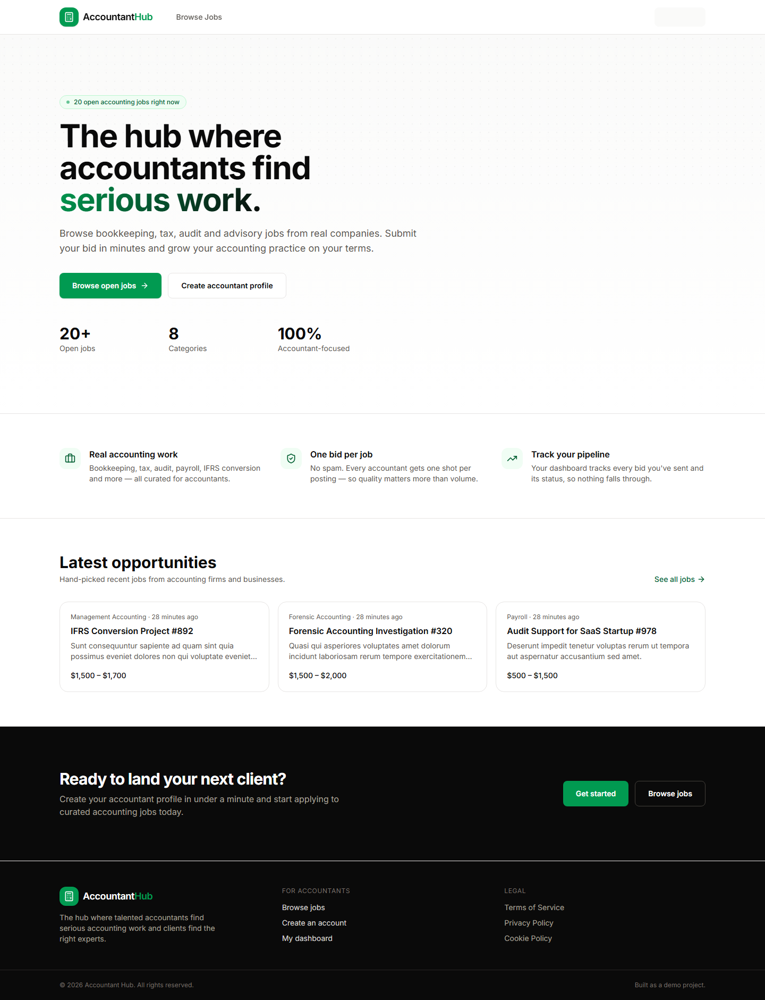
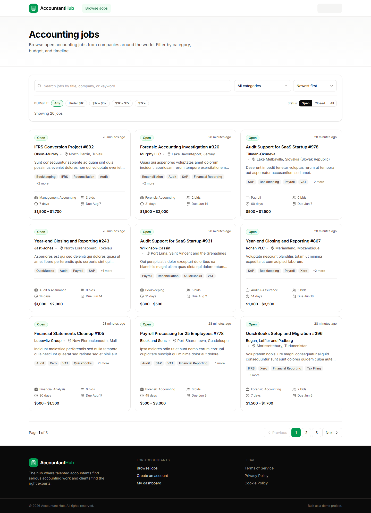
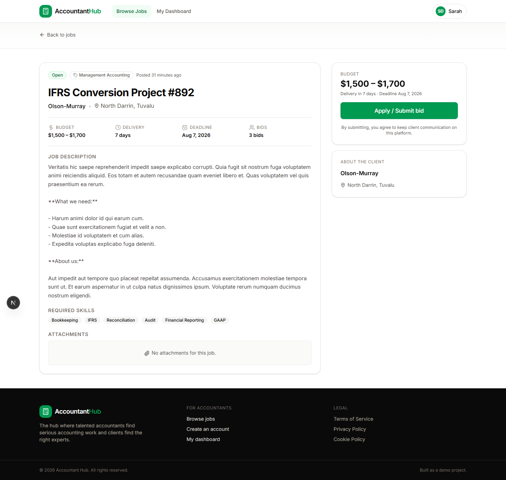
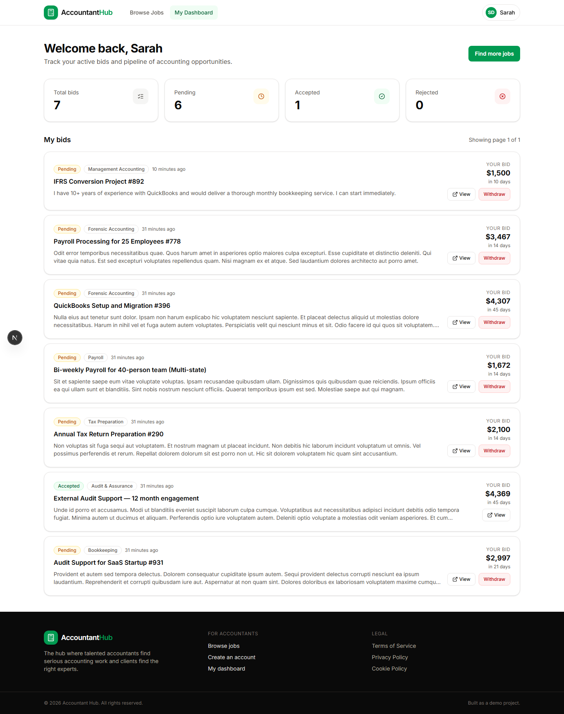
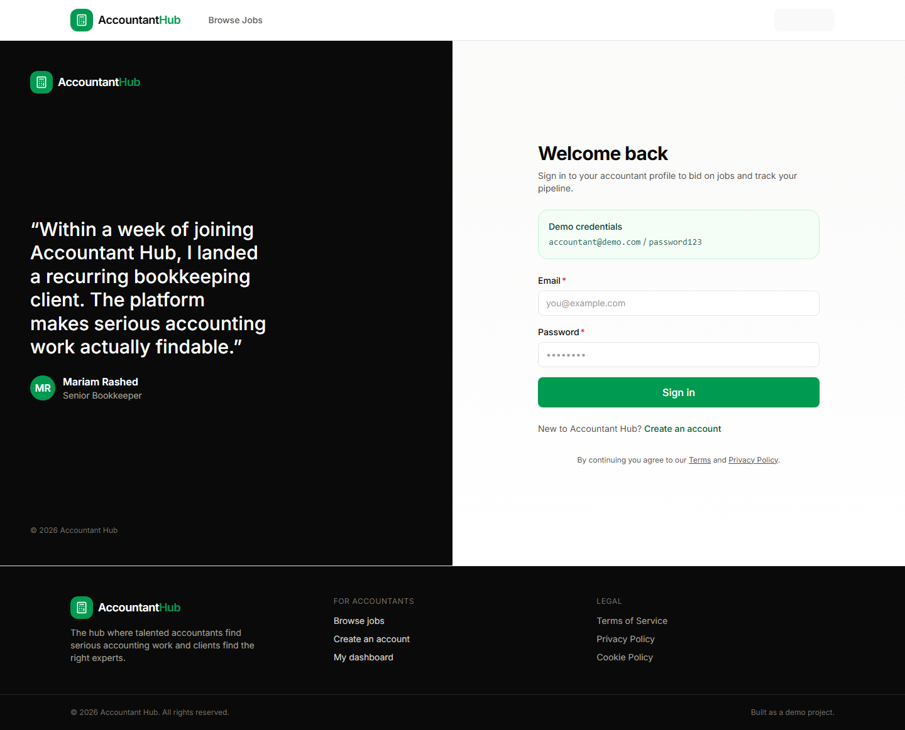
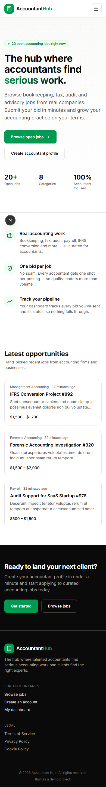

# Accountant Hub

> A polished, end-to-end **Upwork-for-accountants** built as a full-stack solo coding task.
> Companies post accounting jobs, accountants browse and submit bids — one bid per job, per accountant.

This repository contains two apps:

| Folder  | Stack                                                          | Purpose                                                |
| ------- | -------------------------------------------------------------- | ------------------------------------------------------ |
| [`api`](./api) | **Laravel 13** · Sanctum · MySQL / SQLite · API Resources | REST API, auth, validation, business logic, seed data  |
| [`web`](./web) | **Next.js 16** · React 19 · TypeScript · Tailwind v4    | Server + client rendered UI, auth, filters, dashboard  |

---

## ✨ Features

### Required
- 📋 **Jobs listing page** with search, category filter, budget filter, sort, and **pagination**
- 📑 **Job details page** with full description, skills, attachments, budget, deadline, bids count
- 💸 **Submit bid flow** with proposed price, delivery time, cover letter, experience summary, success state
- 🔒 **Authentication** — Register, Login, Logout with Sanctum bearer tokens
- ⛔ **Duplicate prevention** — DB-level unique constraint AND application-level guard
- ✅ **Open / Closed job status** with UI cues and API filtering

### Bonus (all delivered)
- 📊 **Dashboard** showing **My Bids** with stats (total / pending / accepted / rejected)
- 🪂 **Withdraw bid** action for pending bids
- 📄 **Pagination** for jobs and bids
- 🔎 **Advanced filtering** — search debounced, budget presets, category, status, multiple sort options
- 🧩 **Reusable UI components** — Button, Input, Field, Select, Card, Badge, Modal, EmptyState, Skeleton
- 🧬 **API Resources** — clean response formatting with computed fields (`bids_count`, `is_open`, `has_my_bid`)
- 🌱 **Seeded demo data** — curated featured jobs + factory-generated jobs/users/bids
- 📱 **Mobile responsive** — fully responsive layouts, mobile menu, sticky CTA
- 🌗 **Empty / loading / error states** everywhere
- 🛡️ **Form validation** — client (Zod + react-hook-form) and server (Laravel Form Requests)
- 🚀 **Deployment ready** — Vercel + Railway configs, env examples

---

## 🎨 Design

- **Brand palette:** Black `#0a0a0a` + Brand Green `#019a51` (as requested)
- **Style:** Corporate-professional, clean, modern. Inspired by Upwork/LinkedIn but tailored for accountants.
- **Typography:** Inter (Google Fonts)
- **Icons:** Lucide React

---

## 🧰 Tech Stack & Why

| Layer       | Tool                                | Why                                                                                       |
| ----------- | ----------------------------------- | ----------------------------------------------------------------------------------------- |
| Frontend    | **Next.js 16 (App Router)**         | The preferred stack. Server components for SEO + speed, client components for forms.      |
| Forms       | **react-hook-form + Zod**           | Best-in-class validation, low re-renders, schema-typed forms.                             |
| UI          | **Tailwind CSS v4**                 | Latest Tailwind with new `@theme inline` design tokens for full brand control.            |
| Icons       | **Lucide**                          | Open-source, consistent stroke icons that match the corporate-professional brief.         |
| Toasts      | **sonner**                          | Accessible, polished toast notifications.                                                 |
| Backend     | **Laravel 13**                      | The preferred backend. Eloquent + Form Requests + API Resources = clean, testable code.   |
| Auth        | **Laravel Sanctum**                 | Token-based auth, perfect for SPA + API setups.                                           |
| DB (local)  | **SQLite**                          | Zero-setup local dev (no MySQL install needed).                                           |
| DB (prod)   | **MySQL**                           | Per task spec — used in production deployment.                                            |

---

## 🚀 Quick Start (Local)

### 1. Prerequisites
- **Node.js** 20+
- **PHP** 8.2+ with extensions: `mbstring`, `openssl`, `pdo_sqlite` (or `pdo_mysql`), `curl`, `fileinfo`, `intl`
- **Composer** 2.x

> ℹ️ If PHP/Composer aren't installed, you can use **Laragon** (Windows), **Herd** (Mac), or any standard PHP setup.

### 2. Run the API (Laravel)
```bash
cd api
cp .env.example .env
composer install
php artisan key:generate
php artisan migrate:fresh --seed
php artisan serve --host=127.0.0.1 --port=8000
```

The API is now live at **http://127.0.0.1:8000**.

### 3. Run the Web (Next.js)
In a second terminal:
```bash
cd web
cp .env.example .env.local
npm install
npm run dev
```

The web app is now live at **http://127.0.0.1:3000**.

### 4. Sign in
A demo accountant is seeded for you:

| Email                    | Password      |
| ------------------------ | ------------- |
| `accountant@demo.com`    | `password123` |

You can also register a fresh accountant from the UI.

---

## 🌐 API Endpoints

Base URL: `/api/v1`

### Public
| Method | Endpoint                | Description                                   |
| ------ | ----------------------- | --------------------------------------------- |
| POST   | `/auth/register`        | Register a new accountant                     |
| POST   | `/auth/login`           | Log in and receive a Sanctum bearer token     |
| GET    | `/categories`           | List job categories (with `jobs_count`)        |
| GET    | `/jobs`                 | List jobs with filters, sort, pagination       |
| GET    | `/jobs/{slug}`          | Get a single job by slug                       |

### Authenticated (Bearer token required)
| Method  | Endpoint              | Description                                     |
| ------- | --------------------- | ----------------------------------------------- |
| GET     | `/auth/me`            | Get the current user                            |
| POST    | `/auth/logout`        | Revoke the current token                        |
| POST    | `/jobs/{slug}/bids`   | Submit a bid for a job (one per user per job)   |
| GET     | `/me/bids`            | List **my** bids (paginated)                    |
| GET     | `/me/bids/{id}`       | Get one of my bids                              |
| DELETE  | `/me/bids/{id}`       | Withdraw a pending bid                          |
| GET     | `/me/dashboard`       | Bid stats for the current user                  |

### Query parameters for `GET /jobs`
| Param         | Type    | Notes                                                                |
| ------------- | ------- | -------------------------------------------------------------------- |
| `search`      | string  | Matches title / company / short description (LIKE)                   |
| `category`    | string  | Category slug (e.g. `tax-preparation`)                               |
| `budget_min`  | number  | Minimum budget                                                       |
| `budget_max`  | number  | Maximum budget                                                       |
| `status`      | enum    | `open` (default) · `closed` · `all`                                  |
| `sort`        | enum    | `newest` · `oldest` · `budget_high` · `budget_low` · `deadline`      |
| `page`        | integer | Pagination page number                                               |
| `per_page`    | integer | Items per page (1–50, default 9)                                     |

---

## 🗄️ Database Schema

```
users
  id · name · email · password · headline · bio · skills (json) · years_of_experience

job_categories
  id · name · slug (unique) · icon · description

jobs
  id · category_id (FK → job_categories.id, cascade) · title · slug (unique)
  company_name · company_logo · company_location
  short_description · description · required_skills (json) · attachments (json)
  budget_min · budget_max · currency
  delivery_days · deadline · status (enum: open|closed)
  + indexes: (status, created_at), category_id, budget_max

bids
  id · job_id (FK → jobs.id, cascade) · user_id (FK → users.id, cascade)
  proposed_price · delivery_days
  cover_letter · experience_summary
  status (enum: pending|accepted|rejected|withdrawn)
  UNIQUE (job_id, user_id)  -- prevents duplicate bids
```

### Relationships
- A **Job** belongs to a **JobCategory** and has many **Bids**.
- A **User** has many **Bids**.
- A **Bid** belongs to a **Job** and a **User**.
- A user can submit **only one bid per job** — enforced by a DB unique index + controller guard.

---

## 🧪 Manual test plan

1. Visit `/jobs` — see open jobs, try search, category filter, budget presets, sort.
2. Open any job — see full details, bids count, attachments placeholder.
3. Click **Apply** without logging in — you'll be prompted to sign in.
4. Log in as `accountant@demo.com` / `password123`.
5. Apply for a job — validate the form, submit a bid, see success state.
6. Try to apply again on the same job — the button is replaced by "You've already bid".
7. Open `/dashboard` — see stats and your bid list with statuses, withdraw a pending bid.
8. Test on mobile — open the hamburger menu, scroll the jobs grid, submit a bid.

---

## 🚢 Deployment

See [DEPLOYMENT.md](./DEPLOYMENT.md) for step-by-step instructions for:
- **Web (Vercel):** automatic preview deployments, env vars
- **API (Railway):** Laravel + MySQL in one project, environment configuration
- **CORS** and `FRONTEND_URL` setup

---

## 📐 Project Structure

```
.
├── api/                    # Laravel 13 application
│   ├── app/
│   │   ├── Http/
│   │   │   ├── Controllers/Api/   # AuthController, JobController, BidController, ...
│   │   │   ├── Requests/          # Form Requests for validation
│   │   │   └── Resources/         # API Resources for response formatting
│   │   └── Models/                # User, Job, JobCategory, Bid
│   ├── database/
│   │   ├── factories/             # Model factories
│   │   ├── migrations/            # DB schema
│   │   └── seeders/               # Demo data
│   └── routes/api.php             # All endpoints under /api/v1
│
├── web/                    # Next.js 16 application
│   ├── src/
│   │   ├── app/                   # App Router pages
│   │   │   ├── (auth)/            # Login & register pages (route group)
│   │   │   ├── jobs/              # Listing + detail pages
│   │   │   ├── dashboard/         # My Bids dashboard
│   │   │   └── layout.tsx, page.tsx, providers.tsx
│   │   ├── components/
│   │   │   ├── ui/                # Reusable primitives (Button, Card, Input, Modal, ...)
│   │   │   ├── jobs/              # Job-specific components (JobCard, JobFilters, BidForm, ...)
│   │   │   └── layout/            # Header, Footer, Logo
│   │   └── lib/                   # api.ts, auth-context.tsx, types.ts, utils.ts
│   └── tailwind / next config
│
├── screenshots/            # UI preview screenshots
└── README.md
```

---

## 🧠 Assumptions

- **Only accountants register.** Companies/clients posting jobs is **not** in scope per task — jobs come from seed data.
- **Demo deployment** uses SQLite locally for zero-setup; production uses MySQL.
- **Attachments are placeholder only** (JSON column ready; no upload flow built since task says "placeholder, if any").
- **Email notifications** are not implemented (mail driver set to `log` in Laravel).
- **Admin moderation** of jobs/bids is out of scope.

---

## 📸 Screenshots

| Home (desktop)                                 | Jobs listing                                   |
| ---------------------------------------------- | ---------------------------------------------- |
|                 |                 |

| Job detail (signed in)                                | Dashboard                                      |
| ----------------------------------------------------- | ---------------------------------------------- |
|           |       |

| Login                                          | Mobile home                                    |
| ---------------------------------------------- | ---------------------------------------------- |
|               |        |

---

## 👤 Author

Built as a Vibe Coder / Solo Full-Stack Developer evaluation task.
